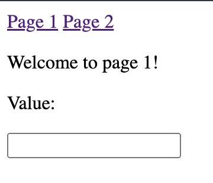
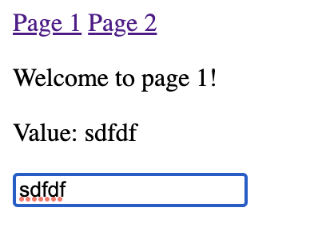
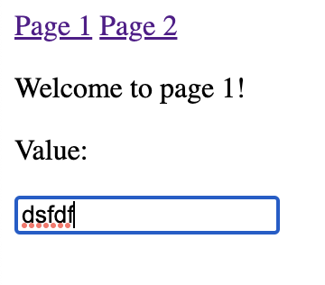

# Navigation Bug

This repo reproduces an bug in livewire where components are not properly evaluated between navigations when dealing with modelable attributes of childrencomponents. 

Steps:

1. Clone and Install deps
2. Run `php artisan serve`
3. Go to the root page and see the following 

4. Enter some input, the value is tracked live with no issue(uses ).

5. Then navigate to page 2 using link(uses `wire:navigate`)

6. Navigate back to page 1 using link, enter input, value is no longer live.

